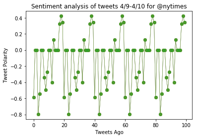
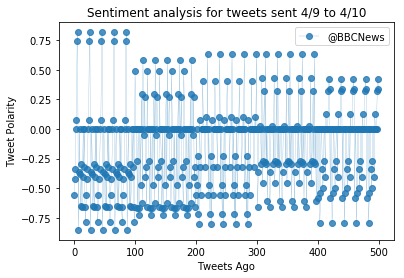

```python
# Dependencies
import numpy as np
import pandas as pd
import matplotlib.pyplot as plt
import json
import tweepy
import time
import seaborn as sns
from Config import cons_key, cons_sec, acc_tkn, acc_tkn_sec

# Initialize Sentiment Analyzer
from vaderSentiment.vaderSentiment import SentimentIntensityAnalyzer
analyzer = SentimentIntensityAnalyzer()
```


```python
consumer_key = cons_key
consumer_secret = cons_sec
access_token = acc_tkn
access_token_secret = acc_tkn_sec

auth = tweepy.OAuthHandler(consumer_key, consumer_secret)
auth.set_access_token(access_token, access_token_secret)
api = tweepy.API(auth, parser=tweepy.parsers.JSONParser())
```


```python
twt_ids = ('@BBCNews', '@CBSNews', '@CNN', '@FoxNews', '@nytimes')

sentiment = []
counter = 1

for account in twt_ids:
    
    for i in range(5):
        public_tweets = api.user_timeline(account)
        
        for tweet in public_tweets:
            
            #print('Tweet %s: %s' % (counter, tweet['text']))
            
            compound = analyzer.polarity_scores(tweet['text'])['compound']
            pos = analyzer.polarity_scores(tweet['text'])['pos']
            neu = analyzer.polarity_scores(tweet['text'])['neu']
            neg = analyzer.polarity_scores(tweet['text'])['neg']
            tweets_ago = counter
        
            sentiment.append({'Account': account, 'Date': tweet['created_at'], 
                               'Compound': compound,
                               'Positive': pos,
                               'Negative': neu,
                               'Neutral': neg,
                               'Tweets Ago': counter})
        
            counter = counter + 1
```


```python
#print(sentiment)
```


```python
sentiment_df = pd.DataFrame.from_dict(sentiment)
sentiment_df.head()
```


<div>
<style>
    .dataframe thead tr:only-child th {
        text-align: right;
    }

    .dataframe thead th {
        text-align: left;
    }

    .dataframe tbody tr th {
        vertical-align: top;
    }
</style>
<table border="1" class="dataframe">
  <thead>
    <tr style="text-align: right;">
      <th></th>
      <th>Account</th>
      <th>Compound</th>
      <th>Date</th>
      <th>Negative</th>
      <th>Neutral</th>
      <th>Positive</th>
      <th>Tweets Ago</th>
    </tr>
  </thead>
  <tbody>
    <tr>
      <th>0</th>
      <td>@BBCNews</td>
      <td>-0.5574</td>
      <td>Tue Apr 10 01:54:42 +0000 2018</td>
      <td>0.660</td>
      <td>0.340</td>
      <td>0.000</td>
      <td>1</td>
    </tr>
    <tr>
      <th>1</th>
      <td>@BBCNews</td>
      <td>-0.4215</td>
      <td>Tue Apr 10 01:54:42 +0000 2018</td>
      <td>0.781</td>
      <td>0.219</td>
      <td>0.000</td>
      <td>2</td>
    </tr>
    <tr>
      <th>2</th>
      <td>@BBCNews</td>
      <td>-0.3400</td>
      <td>Tue Apr 10 01:04:39 +0000 2018</td>
      <td>0.769</td>
      <td>0.231</td>
      <td>0.000</td>
      <td>3</td>
    </tr>
    <tr>
      <th>3</th>
      <td>@BBCNews</td>
      <td>0.0000</td>
      <td>Tue Apr 10 00:55:45 +0000 2018</td>
      <td>1.000</td>
      <td>0.000</td>
      <td>0.000</td>
      <td>4</td>
    </tr>
    <tr>
      <th>4</th>
      <td>@BBCNews</td>
      <td>0.0772</td>
      <td>Mon Apr 09 23:53:09 +0000 2018</td>
      <td>0.843</td>
      <td>0.000</td>
      <td>0.157</td>
      <td>5</td>
    </tr>
  </tbody>
</table>
</div>


```python
sentiment_df.to_csv('news_outlet_sentiment.csv')
```


```python
nytimes_df = sentiment_df.loc[range(400,500),['Account', 'Compound']]
nytimes_df.head()
```


<div>
<style>
    .dataframe thead tr:only-child th {
        text-align: right;
    }

    .dataframe thead th {
        text-align: left;
    }

    .dataframe tbody tr th {
        vertical-align: top;
    }
</style>
<table border="1" class="dataframe">
  <thead>
    <tr style="text-align: right;">
      <th></th>
      <th>Account</th>
      <th>Compound</th>
    </tr>
  </thead>
  <tbody>
    <tr>
      <th>400</th>
      <td>@nytimes</td>
      <td>-0.5859</td>
    </tr>
    <tr>
      <th>401</th>
      <td>@nytimes</td>
      <td>0.0000</td>
    </tr>
    <tr>
      <th>402</th>
      <td>@nytimes</td>
      <td>0.0000</td>
    </tr>
    <tr>
      <th>403</th>
      <td>@nytimes</td>
      <td>-0.7964</td>
    </tr>
    <tr>
      <th>404</th>
      <td>@nytimes</td>
      <td>-0.5423</td>
    </tr>
  </tbody>
</table>
</div>


```python
plt.plot(np.arange(len(nytimes_df['Compound'])),nytimes_df['Compound'], marker='o', linewidth=0.5, alpha= 0.8)

plt.title(f'Sentiment analysis of tweets 4/9-4/10 for @nytimes')
plt.ylabel('Tweet Polarity')
plt.xlabel('Tweets Ago')
plt.show()
```





```python
plt.plot(np.arange(len(sentiment_df['Compound'])), sentiment_df['Compound'], marker='o', linewidth=0.2, alpha= 0.8)
plt.title(f'Sentiment analysis for tweets sent 4/9 to 4/10')
plt.ylabel('Tweet Polarity')
plt.xlabel('Tweets Ago')
plt.legend(sentiment_df['Account'].unique())
plt.show()
```





```python
sentiment_df['Account'].unique()
```


    array(['@BBCNews', '@CBSNews', '@CNN', '@FoxNews', '@nytimes'], dtype=object)


